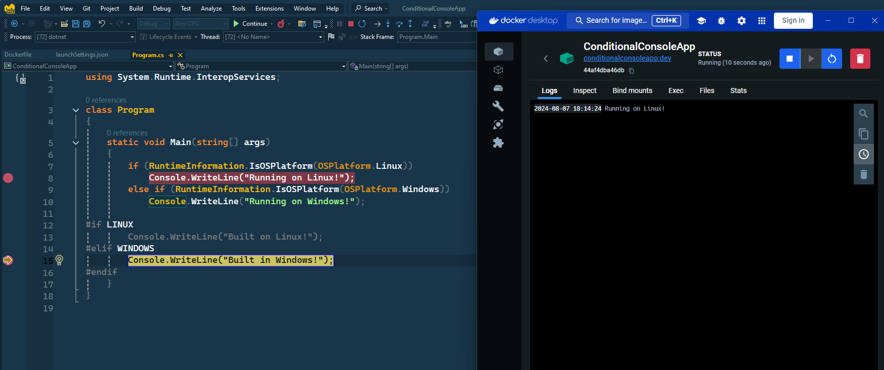
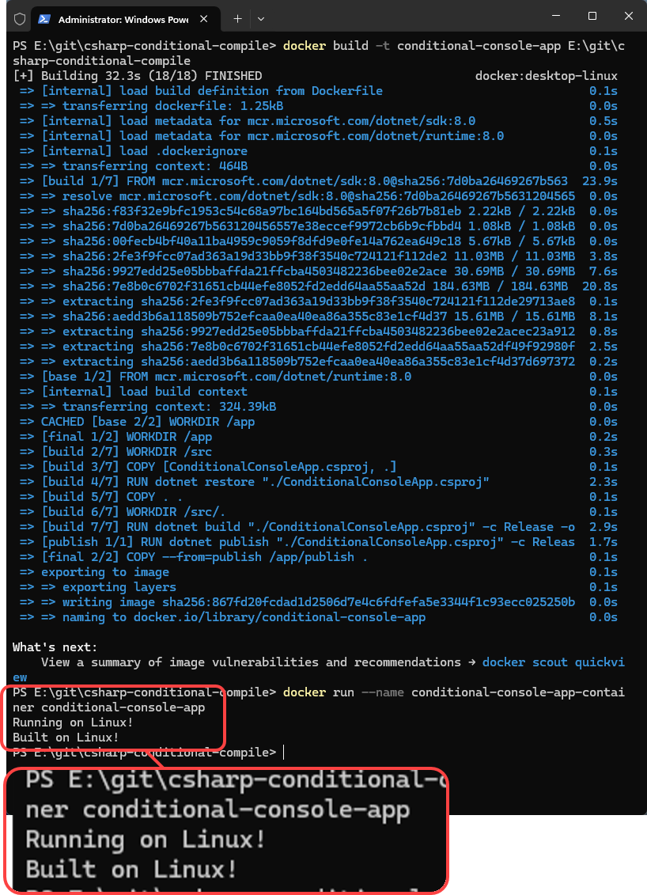

# Conditional Compilation in C#

## References

* [Platform Conditional Compilation in .NET Core](https://blog.magnusmontin.net/2018/11/05/platform-conditional-compilation-in-net-core/)
* [Selective Propagation of Conditionals](https://stackoverflow.com/a/43442076/8954538)

## Quickstart

### Build on Windows, run on Windows


### Build on Windows, run on Linux



### Build on Linux, run on Linux

```powershell
docker build -t conditional-console-app E:\git\csharp-conditional-compile
docker run --name conditional-console-app-container conditional-console-app
```

